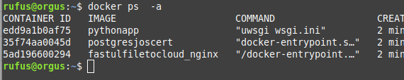

# Docker +  Postgres

## Requisitos

Recomendado desplegarlo sobre linux con los siguientes paquetes: Docker, Docker-Compose, y si usan windows ademas deberan instalar git para windows

## Pasos a seguir para hacer el deploy

1) Clonamos el repositorio

```console
 git-clone git@github.com:JosDuran/FastULFileToCloud.git
```
2) nos ubicamos en la rama flaskandpg, y descargamos esta rama.

```console
 git checkout flaskandpg
```

3) Editamos el archivo docker-compose.yml, en este punto, se debe remplazar la primera parte de la seccion por la ruta absoluta de la carpeta webimages

```console
     volumes:
      - /home/rufus/Descargas/cheat:/cheat
```

4) construimos el ecosistema de contenedores

```console
 docker-compose up --build
```

5) A continuacion se debe listar los procesos creados

```console
 docker ps -a
```


6) Elegir el id del contenedor que apunta a la imagen pythonapp

7) a continuacion, vamos a ingresar a este contenedor, y realizar algunas operaciones en la base de datos para inicializarla.

```console
 docker exec -it edd bin/bash
 flask create_tables
 flask insert_data
 exit
 # Debe remplazar el edd por el id de su contenedor
```
8)  ingresar a la siguiente direccion de su navegador: http://localhost para probar la aplicacion
