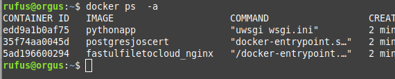

Flask + SSLPostgres + SSLnginx + Docker  

## Requisitos

Recomendado desplegarlo sobre linux con los siguientes paquetes: Docker, Docker-Compose, y si usan windows ademas deberan instalar git para windows

## Advertencia
 la aplicacion que vamos a desplegar, puede llegar a ser insegura, por contener la instruccion sendfile, sin embargo, para fines didacticos nos sera suficiente

## Pasos a seguir para hacer el deploy

1) Clonamos el repositorio

```console
 git-clone git@github.com:JosDuran/FastULFileToCloud.git
```
2) nos ubicamos en la rama nginxsssl, para traer el codigo de la rama correcta

```console
 git checkout nginxsssl
```


 3) Editamos el archivo docker-compose.yml, en este punto, se debe remplazar la primera parte de la seccion por la ruta absoluta de la carpeta webimages

 ```console
     volumes:
      - /home/rufus/Descargas/cheat:/cheat
```

4) ejecutamos el archivo aios_gen_cert.sh (cortesia de https://itnext.io/postgresql-docker-image-with-ssl-certificate-signed-by-a-custom-certificate-authority-ca-3df41b5b53) para generar los certificados
  
```console
 chmod +x aios_gen_cert.sh
 ./aios_gen_cert.sh
```
5) creamos una carpeta ssl y ponemos ahi todos los archivos de clave generados

6) construimos el ecosistema de contenedores

```console
 docker-compose up --build
```

7) A continuacion se debe listar los procesos creados

```console
 docker ps -a
```


8) Elegir el id del contenedor que apunta a la imagen pythonapp

9)  a continuacion, vamos a ingresar a este contenedor, y realizar algunas operaciones en la base de datos para inicializarla.

```console
 docker exec -it edd bin/bash
 flask create_tables
 flask insert_data
 exit
 # Debe remplazar el edd por el id de su contenedor
```
10)  ingresar a la siguiente direccion de su navegador: http://localhost para probar la aplicacion
